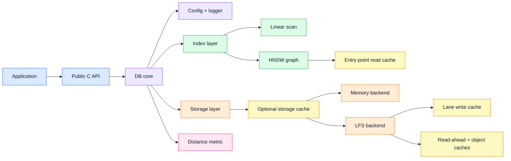

# nn20db — persistent vector search for small offline devices


**nn20db** enables million-scale vector search on small devices.

It runs on Linux and embedded hardware such as the **ESP32-P4**, searches directly from low-cost persistent storage, and is designed for datasets that are **far larger than available RAM**. The goal is simple: local vector search without a server, cloud service, GPU, or large memory budget.

This repository is the public SDK/demo shell for `nn20db`. It contains install tooling, demo applications, Python bindings, and release notes. The proprietary static libraries are not committed to this repository; they are installed into `sdk/<target>/current` from SDK tarballs.

> Status: **beta SDK release**. The API and demo layout may still evolve.


## Performance

| Target   |  Dataset | Vectors | Dim | Storage  | RAM budget | Recall | Queries | Avg query time |
| -------- | -------: | ------: | --: | -------- | ---------: | -----: | ------: | ----------:    |
| ESP32-P4 | SIFT-128 |      1M | 128 | SD card  |     2.5 MB |    88% |     100 |     5.7 sec    |
| ESP32-P4 | SIFT-128 |      1M | 128 | SD card  |     2.5 MB |    98% |     100 |    15.2 sec    |
| Linux    | SIFT-128 |      1M | 128 | SSD      |     4.1 GB |    85% |   10000 |     0.8 ms     |
| Linux    | SIFT-128 |      1M | 128 | SSD      |     4.1 GB |    98% |   10000 |     1.7 ms     |

<sup>(*Cold start. *RAM budget is the main memory reserved for lsf, caching and search. Runtime RAM usage will be slightly higher)<sup>

---

## Current limitations

- The SDK is currently beta.
- The public repository does not contain the source code of the proprietary static libraries. Binary distributions are available via GitHub Releases.
- ESP32 demos are search-only by design, adding vectors on esp32 is possible but it can get slow. It is suggested to add sporadically.
- Large indexes should currently be built on Linux and copied to the target device.
- Multi-threaded search is not implemented yet; use `search_threads = 1`.

---


## Why nn20db?

Most vector databases are designed for servers.

`nn20db` is built for a different problem:

> **How do you search a large vector index when the device has limited RAM, limited CPU, and no cloud connection - while preserving high recall and search quality?**

Typical use cases include:

- edge AI search
- local-first semantic search
- embedded retrieval systems
- ESP32-P4 experiments with large persistent indexes
- Linux-to-embedded workflows where the index is built on Linux and searched on-device

---

## When should you use nn20db?

Use nn20db when:
- the vector index is larger than available RAM
- the device must work offline
- the target is Linux or embedded hardware such as ESP32-P4
- search latency of seconds is acceptable in exchange for low-cost hardware and storage
- the index can be built on Linux and copied to the device

Do not use nn20db if:
- you need the fastest possible server-side vector search
- you need a mature cloud/vector database ecosystem
- you need heavy concurrent writes
- you need sub-millisecond or high-QPS search


## How is this different from other vector databases?

Most existing vector-search systems assume a very different environment: abundant RAM, fast storage, server-class CPUs, or managed infrastructure.

nn20db is focused on a narrower problem: searching large persistent HNSW indexes on very small offline devices, where the full index does not fit in RAM and storage is slow or cheap.

It is a trade-off: nn20db is not designed to win QPS benchmarks. It is designed to make useful vector search possible in places where typical vector databases are too large, too memory-hungry, or require infrastructure that is not available.


## Key features

- **Million-scale vector search**
- **Persistent HNSW index**
- **Works beyond available RAM**
- **Linux and ESP32-P4 SDK builds**
- **Static C library + public headers**
- **Python wrapper for Linux experiments**
- **Search-only embedded demos using indexes built on Linux**
- **Multiple metrics**, including Euclidean, cosine, dot product, Manhattan, Hamming, and Jaccard
- **Offline-first design** — no cloud dependency

---

## Supported targets

| Target | Tested environment |
|---|---|
| Linux | Ubuntu 24.04 |
| ESP32-P4 | Espressif ESP-IDF v5.x |

The current local SDK layout uses:

```text
sdk/linux/current  -> Linux SDK
sdk/esp32/current  -> ESP32-P4 SDK
```

---

## Repository layout

| Path | Purpose |
|---|---|
| `scripts/install-sdk.sh` | Installs a Linux or ESP32 SDK tarball from a local path or release URL. |
| `api/python/` | Minimal Python API wrapper around the Linux SDK. |
| `demos/geo/linux/python/` | GeoNames nearest-city demo; builds a persistent 10k-city index on Linux. |
| `demos/geo/esp32/` | ESP32-P4 search-only version of the GeoNames demo. |
| `demos/sift128/linux/sift_persistent/` | Linux SIFT-128 persistent HNSW recall demo. |
| `demos/sift128/esp32/sift_persistent_search/` | ESP32-P4 search-only SIFT-128 recall demo. |
| `sdk/` | Local SDK install location. Generated after installing SDK tarballs. |

Generated SDK payloads, build outputs, downloaded datasets, and generated databases are intentionally left out of git.

---

## Install the SDK

Install from local tarballs:

```bash
./scripts/install-sdk.sh linux /path/to/nn20db-sdk-linux-<version>.tar.gz
./scripts/install-sdk.sh esp32 /path/to/nn20db-sdk-esp32-<version>.tar.gz
```

Install from GitHub release asset URLs:

```bash
./scripts/install-sdk.sh linux \
  https://github.com/brunokeymolen/nn20db-sdk/releases/download/<tag>/nn20db-sdk-linux-<version>.tar.gz

./scripts/install-sdk.sh esp32 \
  https://github.com/brunokeymolen/nn20db-sdk/releases/download/<tag>/nn20db-sdk-esp32-<version>.tar.gz
```

The installer unpacks the tarball under:

```text
sdk/<target>/
```

and updates:

```text
sdk/<target>/current
```

to point to the installed version.

Expected SDK contents:

| Target | Expected contents |
|---|---|
| Linux | `include/`, `cmake/`, `linux/x86_64-linux-gnu/lib/libnn20db.a`, `linux/x86_64-linux-gnu/pkgconfig/nn20db.pc` |
| ESP32-P4 | `esp32/component/nn20db/include`, `esp32/component/nn20db/lib/esp32p4/libnn20db.a` |

---

## Quick start: GeoNames demo

The easiest demo is the Linux/Python GeoNames demo.

It downloads the GeoNames `cities15000` dataset, indexes the first 10,000 cities as 3D unit-sphere vectors, and runs nearest-city queries for Brussels, Paris, New York, and Tokyo.

First build the Python wrapper:

```bash
make -C api/python
```

Then run:

```bash
python demos/geo/linux/python/demo_geonames_10k.py
```

Rebuild the index from scratch:

```bash
python demos/geo/linux/python/demo_geonames_10k.py --rebuild
```

Useful options:

```text
--max-cities N   Index only the first N cities; default: 10000
--top-k K        Return K nearest neighbours; default: 10
--rebuild        Delete and recreate the index
```

The generated database is stored under:

```text
demos/geo/linux/python/data/geo10k
```

To run the same data on ESP32-P4, copy that directory to the SD card as:

```text
/nand0/geo10k
```

Then build and flash:

```bash
cd demos/geo/esp32
make build
make flash-monitor
```

Use `PORT=/dev/ttyUSB0` or another serial device if needed.

---

## SIFT-128 recall demo

The Linux SIFT demo builds or reopens a persistent HNSW index from the ANN Benchmarks `sift-128-euclidean.hdf5` dataset and prints recall against the ground-truth neighbours.

```bash
cd demos/sift128/linux/sift_persistent
make
./sift_persistent_demo /path/to/sift-128-euclidean.hdf5 ./db/sift128
```

Optional: limit the number of test queries:

```bash
./sift_persistent_demo /path/to/sift-128-euclidean.hdf5 ./db/sift128 250
```

To run the same index on ESP32-P4, copy the generated database directory to the SD card as:

```text
/nand0/sift128
```

Then build and flash:

```bash
cd demos/sift128/esp32/sift_persistent_search
make build
make flash-monitor
```

The ESP32 demos are intentionally search-only. The SDK exposes insertion APIs on ESP32 too, but these demos build databases on Linux because inserts are much slower on constrained flash/SD storage.

---

## Architecture overview

`nn20db` is configured at database-open time with a single `nn20db_config` structure.



The public API drives the DB core through operations such as create/open, add vector, search, get vector, remove, sync, and compact.

The DB core owns the selected index, storage backend, metric implementation, vector shape, metadata size, and logger configuration.

---

## Index layer

The index is selected with `cfg.index.type`:

| Type | Description |
|---|---|
| `NN20DB_INDEX_LINEAR_CONFIG` | Brute-force scan, useful for small data or testing. |
| `NN20DB_INDEX_HNSW_CONFIG` | Hierarchical Navigable Small World graph for approximate nearest-neighbour search. |

HNSW keeps graph nodes in storage and uses an in-memory read cache around the entry-point neighbourhood to reduce repeated storage reads during traversal.

Main HNSW options:

| Option | Meaning |
|---|---|
| `search_threads` | Parallel search threads; `0` uses the default. Multi-threaded search is not implemented yet, so use `1`. |
| `max_levels` | Maximum number of HNSW graph levels. |
| `diversity_alpha` | Neighbour diversity heuristic relaxation; `0.0` disables it, `1.0` is strict, values above `1.0` are more relaxed. |
| `search_seen_set_capacity` | Initial capacity for the search visited set; `0` sizes it automatically. |
| `ef_search` | Candidate list size during search; higher improves recall at higher latency. |
| `level_config[n].M` | Maximum graph connections per node at level `n`. |
| `level_config[n].ef_construction` | Candidate list size during insertion; higher improves graph quality but slows builds. |

Mental model:

- `M` controls graph connectivity.
- `ef_construction` controls build quality.
- `ef_search` controls search effort.
- `k` controls how many results the caller asks for.

---

## Storage layer

The storage layer is selected with `cfg.storage.type`:

| Type | Description |
|---|---|
| `NN20DB_STORAGE_MEMORY_CONFIG` | Segment-based RAM storage; optionally backed by a device path in the current header. |
| `NN20DB_STORAGE_LFS_CONFIG` | Log-structured and lane-based filesystem backend. |

The optional storage-cache decorator wraps any backend:

| Option | Meaning |
|---|---|
| `cache.enabled` | Enables the in-RAM read cache. |
| `cache.max_entries` | Maximum cached object count; `0` uses the default of 256. |
| `cache.max_object_size_bytes` | Maximum cached object size; with LFS, `0` inherits `lfs.object_cache_size_bytes`. |

The LFS backend stores append-only lane files plus update logs. Writes are coalesced through per-lane write buffers. Reads use read-ahead, object pointer slots, merged-object caching, and log-index lookups so updates can be merged with base objects without rewriting whole lanes immediately.

Important LFS options:

| Option | Meaning |
|---|---|
| `lfs.device_path` | Database path or device path. |
| `lfs.mount_point` | Platform mount point; empty means no platform mount is needed. |
| `lfs.lane_cache_size_kb` | Per-lane write buffer size. |
| `lfs.lane_size_mb` | Maximum lane file size. |
| `lfs.log_size_mb` | Update-log budget; `0` uses the backend default. |
| `lfs.log_index_buckets` | Per-lane log-index hash buckets. |
| `lfs.object_cache_size_bytes` | Per-slot object cache size; four rotating slots are allocated. |
| `lfs.read_ahead_size_bytes` | Opportunistic read-ahead per object read; `0` uses the default. |
| `lfs.block_size` | I/O alignment boundary; `0` uses the default. |
| `lfs.flags` | Storage flags, including `NN20DB_STORAGE_FLAGS_DISABLE_CRC`. |

---

## Vector and metric options

Each database has a fixed vector shape:

| Option | Meaning |
|---|---|
| `vector.type` | `NN20DB_DIMENSION_FLOAT32_CONFIG` or `NN20DB_DIMENSION_BIT_CONFIG`. |
| `vector.dimension` | Number of dimensions per vector. |
| `vector.metadata_size` | Application metadata bytes stored alongside each vector. |

Supported metric types in the current SDK header:

| Metric | Notes |
|---|---|
| `METRIC_COSINE_CONFIG` | Cosine distance. |
| `METRIC_EUCLIDEAN_CONFIG` | Euclidean/L2 distance. |
| `METRIC_EUCLIDEAN_AVX2_CONFIG` | AVX2-accelerated Euclidean distance on x86_64. |
| `METRIC_DOT_PRODUCT_CONFIG` | Dot product / inner product. |
| `METRIC_MANHATTAN_CONFIG` | Manhattan/L1 distance. |
| `METRIC_HAMMING_CONFIG` | Hamming distance for binary vectors. |
| `METRIC_JACCARD_CONFIG` | Jaccard distance. |
| `METRIC_COSINE_F32_CONFIG` | Single-precision cosine, preferred on ESP32 hardware FPU. |
| `METRIC_EUCLIDEAN_F32_CONFIG` | Single-precision Euclidean, preferred on ESP32 hardware FPU. |

---

## Logger

`cfg.logger` can override the global logger:

| Option | Meaning |
|---|---|
| `logger.enabled` | `0` leaves logger settings unchanged; `1` applies this config. |
| `logger.level` | Minimum emitted log level. |
| `logger.path` | Log file path; empty uses the SDK default. |


---

## License

The SDK and pre-compiled binaries released here can be used freely for private and educational use.

Commercial use requires prior written agreement.

The software is provided **as is**, without warranty of any kind. The author makes no guarantees regarding reliability, correctness, fitness for a particular purpose, or continued availability of the SDK.

Author: Bruno Keymolen  
Contact: bruno.keymolen@gmail.com
