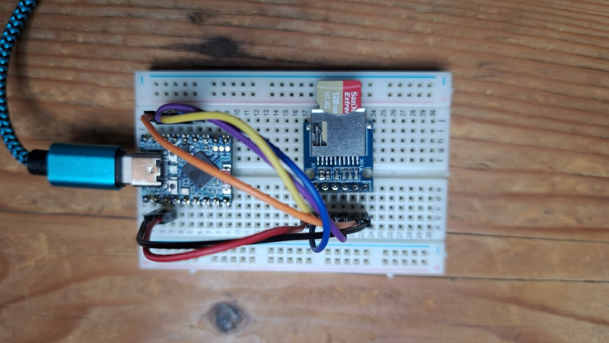

# sift_persistent_search — SIFT-128 recall demo (ESP32-P4 / ESP32-S3)

This demo opens a pre-built SIFT-128 database on an SD card, runs a set of
test queries and reports recall@10 — the same measurement as the Linux
counterpart in `demos/sift128/linux/sift_persistent/`.

> **Search-only demo.**  
> nn20db supports inserting vectors on the ESP32 (the SDK exposes the same
> insert API), but insertions are significantly slower than on a PC because
> of the constrained storage bandwidth.  The database is built once on Linux
> and then copied to the device.

---

## Prerequisites

- ESP-IDF v5.x installed and sourced (`idf.py` on `$PATH`)
- nn20db ESP32 SDK installed (`make build` will tell you if it is missing)
- The SIFT-128 database built with `demos/sift128/linux/sift_persistent/`

---


## PQ vs fp32

The demo builds in one of two vector configurations, selected with `USE_PQ`
(default `1`); the same toggle exists in the Linux generator:

Build              | Config file          | SD card DB path      | Node size
-------------------|----------------------|----------------------|----------
`USE_PQ=1` (deflt) | `main/config_pq.h`   | `/sdcard/nand0/siftpq`  | ~1.2 KB
`USE_PQ=0`         | `main/config_fp32.h` | `/sdcard/nand0/sift128` | ~1.7 KB

Both configs open the DB **read-only** (`NN20DB_STORAGE_FLAGS_READ_ONLY`),
which enables FATFS fast-seek (`CONFIG_FATFS_USE_FASTSEEK` in
`sdkconfig.defaults`) — without it every random read walks the FAT chain of
the 128 MB lane files. They also warm the HNSW node cache around the entry
point at open (`tuning.hnsw_cache_warm_depth`).

## SD card board driver

nn20db has a built-in per-target SD driver, but its ESP32-S3 default mounts
1-bit @ 20 MHz on the IDF default pins — the wrong wiring for most boards —
and its ESP32-P4 default mounts the native slot at only 20 MHz. The demo
therefore registers a board-specific driver, selected at build time with
`SD_BOARD` (one `main/sd_storage_<board>.c` per board; add a new file to
support new hardware):

Board                              | `SD_BOARD`                | Transport | Default on
-----------------------------------|---------------------------|-----------|-----------
Waveshare ESP32-S3-Touch-LCD-1.47  | `waveshare_s3_touch`      | SDMMC     | esp32s3
Waveshare ESP32-S3-Zero + microSD  | `waveshare_s3_zero_sdspi` | SDSPI     | (opt-in)
Waveshare ESP32-P4                 | `waveshare_p4`            | SDMMC     | esp32p4
nn20db built-in target default     | `none`                    | —         | (opt-in only)

The two SDMMC drivers (`waveshare_s3_touch`, `waveshare_p4`) mount 4-bit
@ 40 MHz. The P4 driver also brings up the on-chip LDO (channel 4, i.e.
`LDO_VO4`) that powers the native slot's IO domain before mounting — required
at 40 MHz on that slot. The number of data lines can be overridden for I/O
experiments:

```bash
make build                  # 4-bit (default)
make build SD_BUS_WIDTH=1   # 1-bit, same pins and clock
make build SD_BOARD=none    # no driver, nn20db built-in default (20 MHz)
```

The `waveshare_s3_zero_sdspi` driver targets an ESP32-S3-Zero with a generic
microSD breakout wired to the FSPI (SPI2) bus. SD in SPI mode is inherently
single-data-line, so `SD_BUS_WIDTH` does not apply; the bus clock defaults to
20 MHz (jumper-wire breakouts are often unreliable faster) and is overridable
with `SD_SPI_FREQ_KHZ`:

```bash
make build SD_BOARD=waveshare_s3_zero_sdspi                       # 20 MHz (default)
make build SD_BOARD=waveshare_s3_zero_sdspi SD_SPI_FREQ_KHZ=40000 # 40 MHz, clean wiring only
```

Wiring (microSD breakout → ESP32-S3-Zero):

Breakout | ESP32-S3-Zero | Function
---------|---------------|---------
CS       | GPIO10        | FSPICS0
MOSI     | GPIO11        | FSPID
SCK      | GPIO12        | FSPICLK
MISO     | GPIO13        | FSPIQ
GND      | GND           | Ground
3V3      | 3V3           | Power


[sift-search] recall@10 = 0.8800  (880/1000 over 100 queries)  avg_search=3.712s<br>
[sift-search] io_stats search: gets=95393 cache_hits=3020 (3.2%) backend_gets=92373 preads=92373 bytes_read=212915703


## Build the database (Linux)

```bash
cd demos/sift128/linux/sift_persistent
make                  # PQ (default); use make USE_PQ=0 for fp32
./sift_persistent_demo /path/to/sift-128-euclidean.hdf5 ./db/siftpq
```

The dataset file `sift-128-euclidean.hdf5` can be downloaded from:  
`http://ann-benchmarks.com/sift-128-euclidean.hdf5`

Then copy the database directory to the SD card (match the build variant):

```
demos/sift128/linux/sift_persistent/db/siftpq/   →  <SD card>/nand0/siftpq/    (PQ)
demos/sift128/linux/sift_persistent/db/sift128/  →  <SD card>/nand0/sift128/   (fp32)
```

Insert the SD card into the ESP32-P4 before flashing (or reset the ESP32
after inserting the card).

---

## sdkconfig

`sdkconfig` is generated from these fragments, merged in order (later wins).
The target file (`.esp32p4` / `.esp32s3`) is auto-selected by `idf.py set-target`;
the board file is merged by the Makefile when a matching `SD_BOARD` is set.

File                                        | Merged when                       | Key settings
--------------------------------------------|-----------------------------------|-------------
`sdkconfig.defaults`                        | always                            | Shared: FreeRTOS stack sizes, FAT (4096 sectors, 2 volumes, no LFN), VFS 8 slots
`sdkconfig.defaults.esp32p4`                | target = esp32p4                  | HEX PSRAM, 200 MHz, malloc fallback, `FATFS_ALLOC_PREFER_EXTRAM`, chip rev v1.0 (see Troubleshooting)
`sdkconfig.defaults.esp32s3`                | target = esp32s3                  | **Octal** PSRAM, 40 MHz, malloc fallback, `FATFS_ALLOC_PREFER_EXTRAM`
`sdkconfig.board.waveshare_s3_zero_sdspi`   | `SD_BOARD=waveshare_s3_zero_sdspi` | **Quad** PSRAM + 4 MB flash — overrides the octal S3 default for the ESP32-S3-Zero (ESP32-S3FH4R2)

> The S3 default is **octal** PSRAM (S3-Touch's 8 MB die). The **S3-Zero** has a
> 2 MB **quad** die; driving it in octal mode aborts at boot with
> `octal_psram: PSRAM chip is not connected`. Selecting `SD_BOARD=waveshare_s3_zero_sdspi`
> pulls in the quad override — but **only when `sdkconfig` is regenerated**
> (a `set-target` or a build after `rm sdkconfig`). The `make s3-zero` target below
> does this for you.

## Build examples

Board sdkconfig overrides are applied only when `sdkconfig` is (re)generated, so
each target below starts from a clean `sdkconfig`. The `make <board>` convenience
targets run `set-target` + `build` together with the correct `SD_BOARD`, which is
the safest way to switch boards.

> `SD_BOARD` is a **variable**, not a positional argument.
> `make build ... waveshare_s3_zero_sdspi` fails with
> *"No rule to make target"* — use `SD_BOARD=waveshare_s3_zero_sdspi`.

Add `USE_PQ=0` to any command below for the fp32 config (default is PQ).

### ESP32-P4 (Waveshare) — SDMMC, 4-bit @ 40 MHz

```bash
make p4                                   # set-target esp32p4 + build (SD_BOARD=waveshare_p4)
make p4 USE_PQ=0                           # same, fp32 config
```

Equivalent explicit form:

```bash
rm -rf build sdkconfig
idf.py set-target esp32p4
make build SD_BOARD=waveshare_p4
```

### ESP32-S3-Touch-LCD-1.47 (Waveshare) — SDMMC, 4-bit @ 40 MHz, octal PSRAM

```bash
make s3-touch                              # set-target esp32s3 + build (SD_BOARD=waveshare_s3_touch)
make s3-touch USE_PQ=0
```

### ESP32-S3-Zero (Waveshare) + microSD breakout — SDSPI, quad PSRAM

```bash
make s3-zero                               # set-target esp32s3 + build (SD_BOARD=waveshare_s3_zero_sdspi)
make s3-zero USE_PQ=0
make s3-zero SD_SPI_FREQ_KHZ=40000         # 40 MHz SPI clock (clean wiring only; default 20 MHz)
```

SPI mode is single-line, so `SD_BUS_WIDTH` does not apply here (see the wiring
table above).

### SD bus width (SDMMC boards only)

The two SDMMC drivers (`waveshare_p4`, `waveshare_s3_touch`) mount 4-bit by
default. Force 1-bit (same pins and clock) for I/O experiments or flaky wiring:

```bash
make p4       SD_BUS_WIDTH=1               # P4, 1-bit SDMMC
make s3-touch SD_BUS_WIDTH=1               # S3-Touch, 1-bit SDMMC
make build    SD_BUS_WIDTH=1               # current target/board, 1-bit
```

`SD_BUS_WIDTH` is ignored by the SDSPI driver (`waveshare_s3_zero_sdspi`) and by
`SD_BOARD=none`.

---

## Build, flash and run

```bash
cd demos/sift128/esp32/sift_persistent_search

make build USE_PQ=0 # compile (PQ config; use make build USE_PQ=0 for fp32)
make flash          # flash to device on /dev/ttyACM0, some s3 have /dev/ttyUSB0
make monitor        # open serial monitor (Ctrl-] to exit)

make flash-monitor  # flash and open monitor in one step
```

To use a different serial port:

```bash
make flash-monitor PORT=/dev/ttyUSB0

make PORT=/dev/ttyUSB0 flash monitor
```

To clean build artefacts:

```bash
make clean
```

---

## Expected output

```
[sift-search] opening DB at /sdcard/nand0/sift128
[sift-search] DB open OK
[sift-search] query_0000: hits=10/10  (top results: id=... d=...)  time=x.xxxs
[sift-search] query_0001: hits=10/10  ...
...
[sift-search] recall@10 = 0.9800  (980/1000 over 100 queries)
[sift-search] done
```

Recall figures match those reported by the Linux demo.

---

## Troubleshooting

### `chip revision in range [v3.1 - v3.99] (tin case of chip revision v1.0)`

```
A fatal error occurred: bootloader/bootloader.bin requires chip revision in range [v3.1 - v3.99] (this chip is revision v1.0). Use --force to flash anyway.
```

`sdkconfig` has `CONFIG_ESP32P4_REV_MIN_301=y` (minimum supported chip
revision v3.1), but the actual ESP32-P4 silicon on the (Waveshare) board is
an earlier revision (v1.0). ESP-IDF's ESP32-P4 default targets MP silicon
(rev >= v3.0); support for rev < v3.0 and rev >= v3.0 chips is mutually
exclusive (`CONFIG_ESP32P4_SELECTS_REV_LESS_V3`), so the bootloader built
against the v3.0+ family refuses to boot on the older chip and esptool
aborts the flash instead of writing a bootloader the chip can't run.

Fix: select the rev < v3.0 chip family and lower the minimum supported
revision to v1.0 to match the board, either via menuconfig:

```bash
idf.py menuconfig
# Component config -> Hardware Settings -> Chip revision ->
#   "Minimum Supported ESP32-P4 Revision" -> select "Rev v1.0" (or lower)
#   (this also flips CONFIG_ESP32P4_SELECTS_REV_LESS_V3 on)

rm -rf build && idf.py build && make flash
```

or by editing `sdkconfig` directly — this is the resulting diff:

```diff
@@ -1250,17 +1250,18 @@
 #
 # Read the help text of the option below for explanation
 #
-# CONFIG_ESP32P4_SELECTS_REV_LESS_V3 is not set
-# CONFIG_ESP32P4_REV_MIN_300 is not set
-CONFIG_ESP32P4_REV_MIN_301=y
-CONFIG_ESP32P4_REV_MIN_FULL=301
-CONFIG_ESP_REV_MIN_FULL=301
+CONFIG_ESP32P4_SELECTS_REV_LESS_V3=y
+# CONFIG_ESP32P4_REV_MIN_0 is not set
+# CONFIG_ESP32P4_REV_MIN_1 is not set
+CONFIG_ESP32P4_REV_MIN_100=y
+CONFIG_ESP32P4_REV_MIN_FULL=100
+CONFIG_ESP_REV_MIN_FULL=100
 
 #
-# Maximum Supported ESP32-P4 Revision (Rev v3.99)
+# Maximum Supported ESP32-P4 Revision (Rev v1.99)
 #
-CONFIG_ESP32P4_REV_MAX_FULL=399
-CONFIG_ESP_REV_MAX_FULL=399
+CONFIG_ESP32P4_REV_MAX_FULL=199
+CONFIG_ESP_REV_MAX_FULL=199
 CONFIG_ESP_EFUSE_BLOCK_REV_MIN_FULL=0
 CONFIG_ESP_EFUSE_BLOCK_REV_MAX_FULL=199
```

Since `sdkconfig` is regenerated from `sdkconfig.defaults` +
`sdkconfig.defaults.esp32p4` whenever you run `rm -rf build sdkconfig &&
idf.py set-target esp32p4` (see [sdkconfig](#sdkconfig) above), the two lines
```
CONFIG_ESP32P4_SELECTS_REV_LESS_V3=y
CONFIG_ESP32P4_REV_MIN_100=y
```
have also been added to `sdkconfig.defaults.esp32p4` so the fix survives a
clean re-target instead of reverting to IDF's v3.0+ default.

If you don't have menuconfig access, you can flash past the check with
`esptool.py ... --force`, but this is a dev-only workaround — the sdkconfig
should still be corrected so future `make flash` runs don't hit the same
error.
